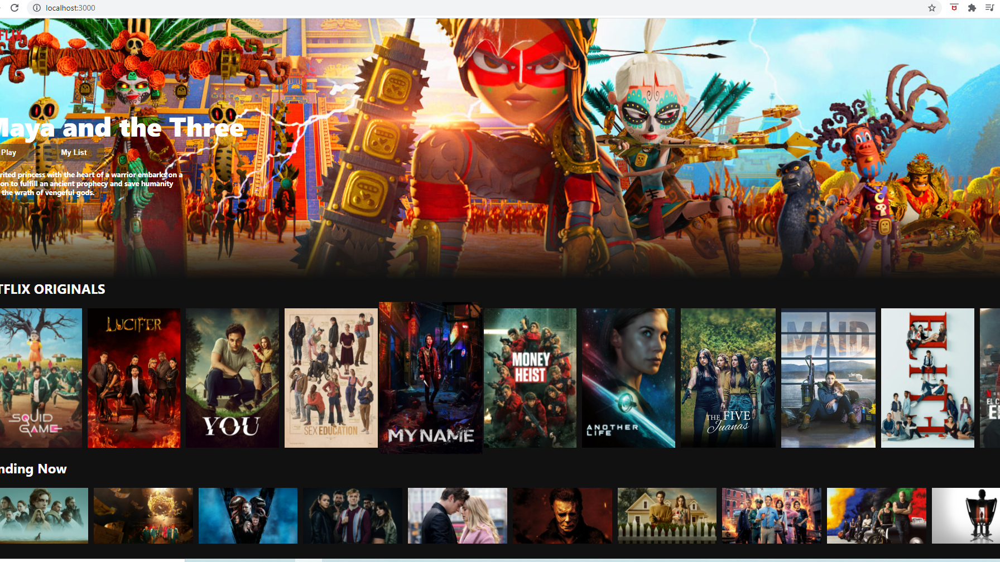

# Getting Started with Create React App

This project was bootstrapped with [Create React App](https://github.com/facebook/create-react-app).

## Clone the repo & run `npm start`

Runs the app in the development mode.\
Open [http://localhost:3000](http://localhost:3000) to view it in the browser.

## The app is Hosted in Firebase
open [https://netflix-clone-d1822.web.app/](https://netflix-clone-d1822.web.app/) to view it directly.

The page will reload if you make edits.\
You will also see any lint errors in the console.

